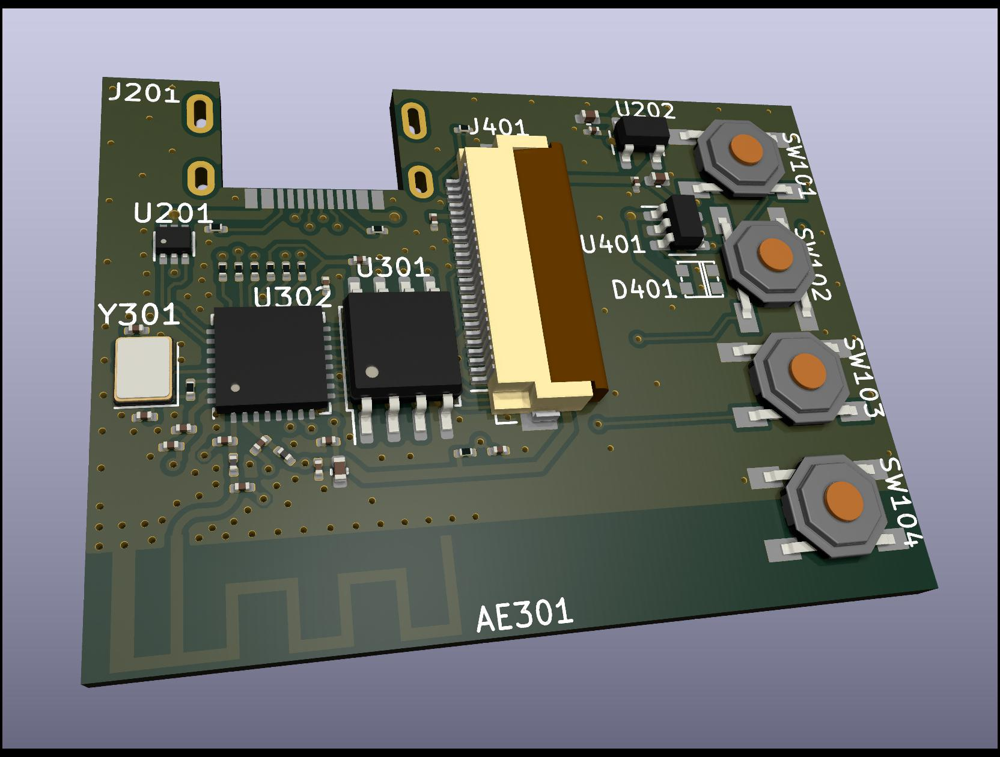
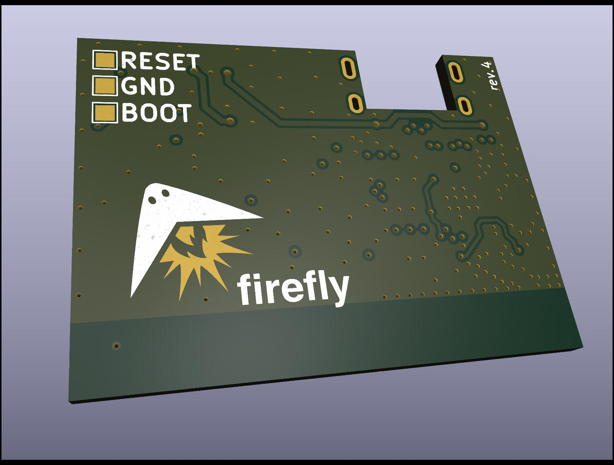

Firefly Pixie
=============

The Firefly Pixie is a low-cost, high-quality hardware wallet
for the Ethereum (and ilk) blockchain. See the
[firmware](https://github.com/firefly/pixie-firmware) repository
for the necessary software to flash on the device.

This repository stores the hardware design files, schematics and
PCB layouts which can be opened using the amazing open source
EDA Application, [KiCad](https://www.kicad.org).

See the [CHANGELOG](./CHANGELOG.md) for high-level changes
between board revisions.

Firefly Pixie Tech Specs
------------------------

- **Processor:** ESP32-C3 (32-bit RISC-V)
- **Speed:** 160Mhz
- **Memory:** 400kb RAM, 16Mb Flash, 4kb eFuse
- **Inputs:** 4x tactile buttons
- **Outputs:**
  - 240x240px IPS 1.3" display (16-bit color)
  - 4x RGB LED (WS2812B)
- **Conectivity:**
  - USB-C
  - BLE

Photos
-----------

See the [output](./output/) folder for rendered schematics, PCBs
and 3D renders along with photos of the various revisions.

  
  

License
-------

MIT License. *(some dependenceies are BSD Licensed)*
