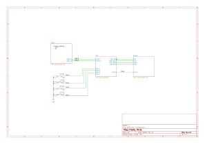

Firefly Pixie (Rev.5)
=====================

The Rev.4 of the compact Firefly Hardware Wallet.

Firefly Pixie Specifications
----------------------------

- **Processor:** ESP32-C3 (32-bit RISC-V)
- **Speed:** 160Mhz
- **Memory:** 400kb RAM, 16Mb Flash, 4kb eFuse
- **Inputs:** 4x tactile buttons
- **Outputs:**
  - 240x240px IPS 1.3" display (16-bit color)
  - 4x RGB LED (WS2812B)
- **Conectivity:**
  - USB-C
  - BLE

Screenshots
-----------

**Schematic**

  
  

  
  

**3D Renders**

  
  

License
-------

MIT License. *(some dependenceies are BSD Licensed)*
