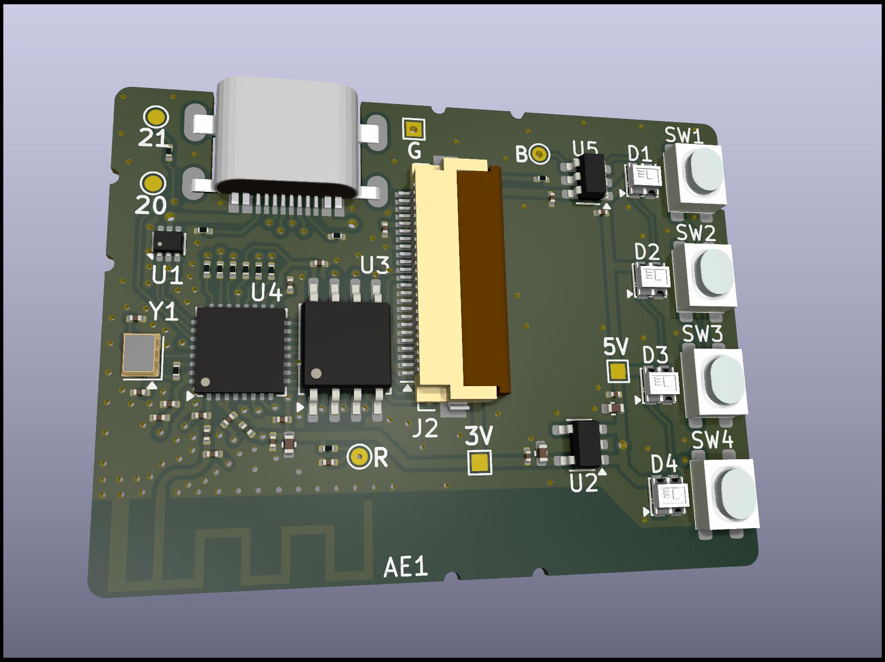
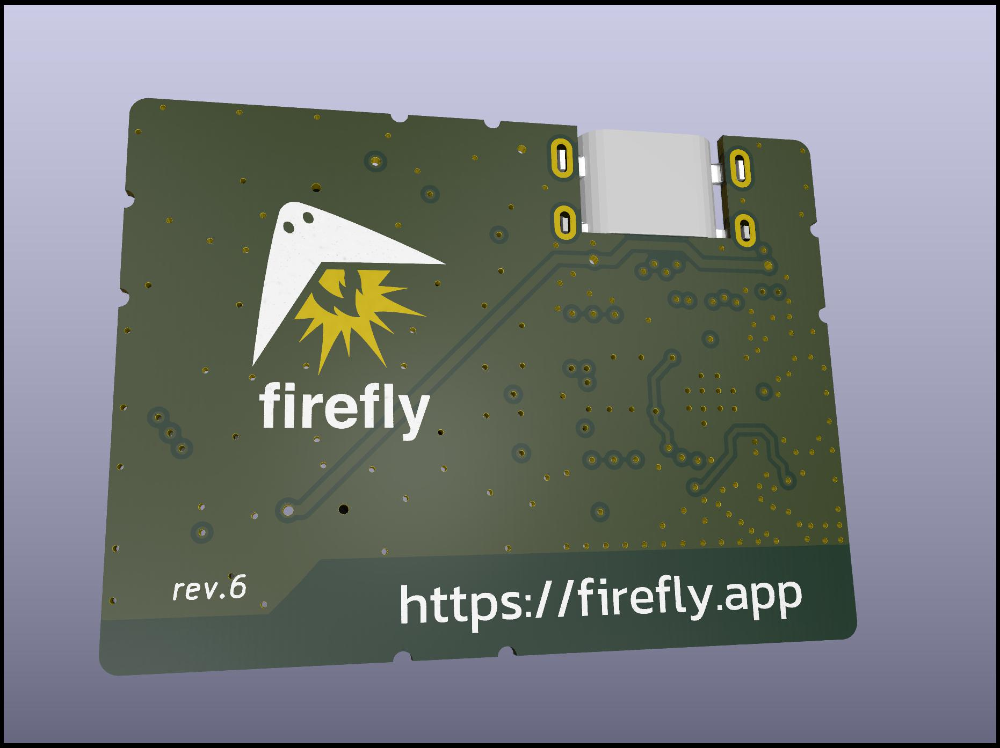

Firefly Pixie: Hardware
=======================

The hardware design, schematics and PCB layouts for the Firefly
Pixie Hardware Wallet for Ethereum (and ilk).

- [Firmware](https://github.com/firefly/pixie-firmware)
- [Case](https://github.com/firefly/pixie-case)

See the [CHANGELOG](./CHANGELOG.md) for high-level changes
between board revisions.

Tech Specs
----------

- **Processor:** ESP32-C3 (32-bit RISC-V)
- **Speed:** 160Mhz
- **Memory:** 400kb RAM, 16Mb Flash, 4kb eFuse
- **Inputs:** 4x tactile buttons
- **Outputs:**
  - 240x240px IPS 1.3" display (16-bit color; RGB565)
  - 4x RGB LED (WS2812B; 24-bit color; GRB888)
- **Connectivity:**
  - USB-C (power + JTAG/CDC-ACM)
  - BLE

Contributing
------------

- To modify the files, use [KiCad](https://www.kicad.org) (open-source EDA application)
- Since the `git diff` involved in modifying these files is somewhat opaque, please start a discussion first, so any changes can be coordinated

Photos
-----------

See the [output](./output/) folder for rendered schematics, PCBs
and 3D renders along with photos of the various revisions.

  
  

License
-------

MIT License.
