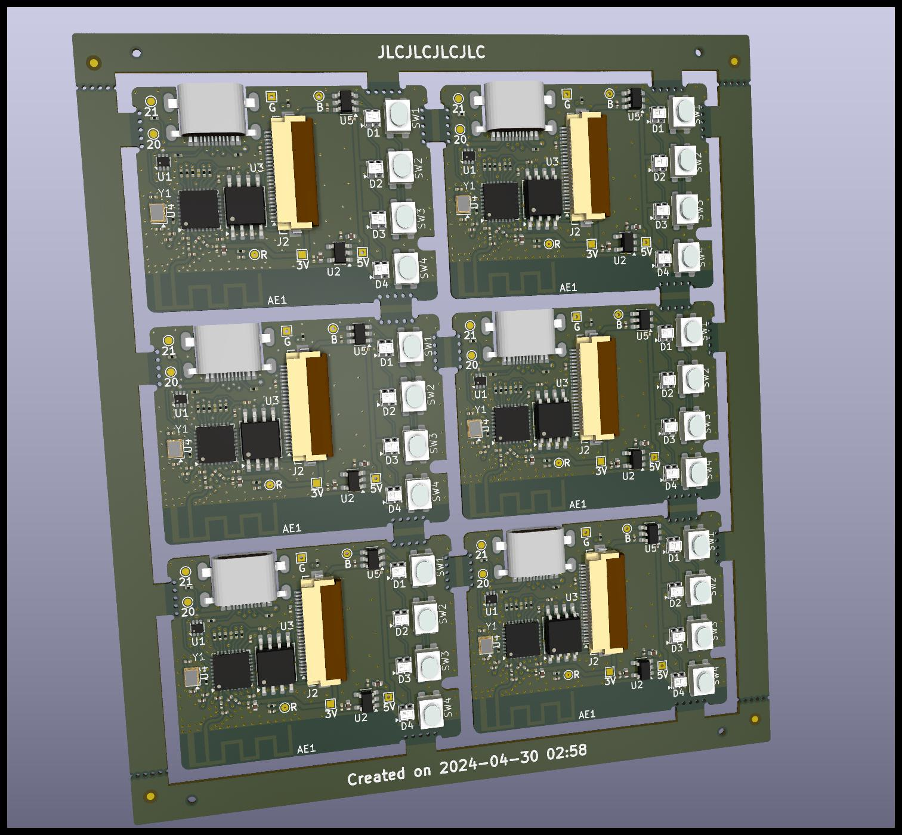
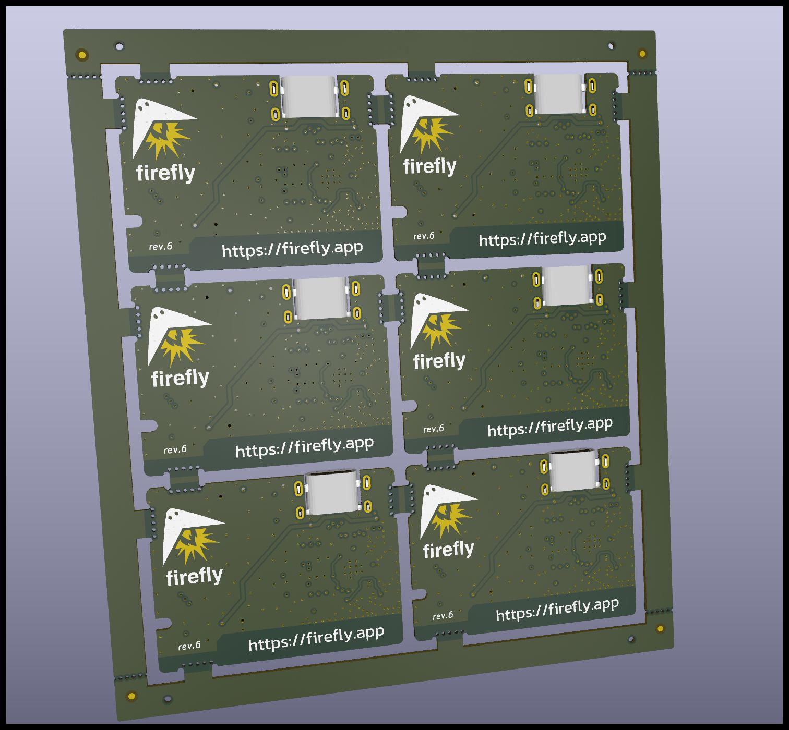
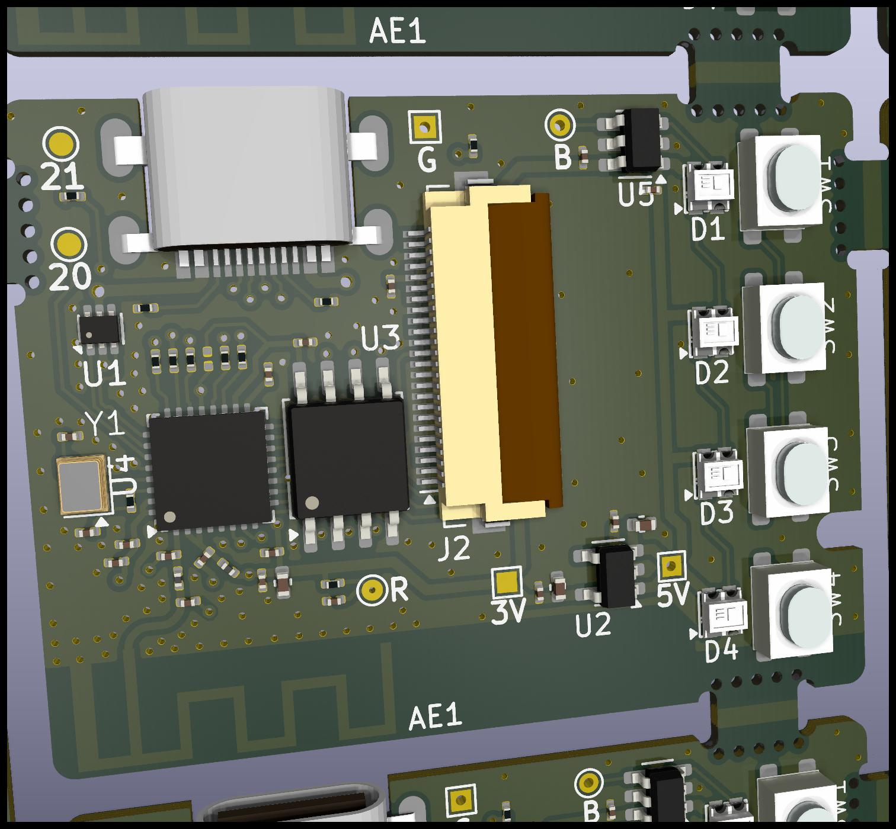

Panelize
========

This folder uses [KiKit](https://github.com/yaqwsx/KiKit/tree/master) to
create panelized versions of the Firefly Pixie device.

Usage
-----

First, it is important to ensure the KiCad-specific Python runtime has
the KiKit library installed:

```shell
# MacOS
/Users/firefly> /Applications/KiCad/KiCad.app/Contents/Frameworks/Python.framework/Versions/Current/bin/pip3 install KiKit

# Windows
@TODO

# Linux
@TODO
```

Then the `./panelize.sh` can be run in this folder, which creates the
output `panel.kicad_pcb` in the same folder.

```shell
/Users/firefly/pixie-device/panel> ./panelize.sh
```

Renders
-------

<p align="center">
  
  
</p>

<p align="center">
  
  
</p>


Notes
-----

If moving the tabs in the Firefly Pixie KiCad project (in the parent
folder), make sure to follow the convention it uses for tabs, to ensure
this panelize works correctly:

- The tab must be 4.4mm long, with a 1mm radius 180deg arc on both sides
- The "Tab" footprint should be flush and cneter with the tab,with its width set to "4.4mm"

License
-------

All files are licensed under the MIT license.

The PCB Footprints used are licensed uder the MIT license by KiKit.
